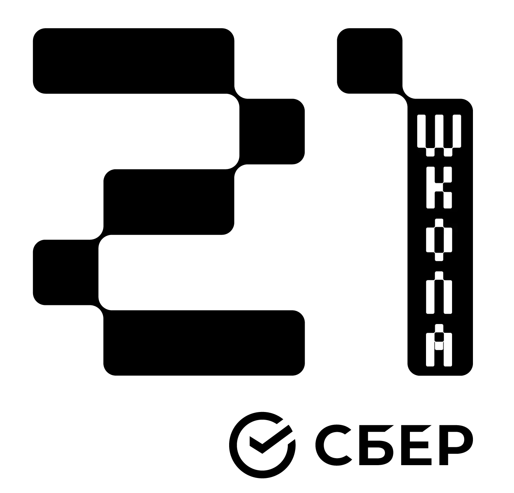

# cub3d_42   

## Localization <a name="RefContents"></a>

* [English](#RefLocEnglish)
* [Русский](#RefLocRussian)

# English localization <a name="RefLocEnglish"></a>

## Contents <a name="RefContentsEn"></a>

* [Goal](#RefGoalEn)
* [Installing and building the program](#RefInstallEn)
* [Control](#RefControlEn)
* [General rules](#RefGeneralRulesEn)

## Goal <a name="RefGoalEn"></a>

The `cub3d` project is a mini-walker using the `raycasting` technology, which was used in the first shooter of the 90s Wolfenstein.
The goal of the project is to create a labyrinth with texture rendering of walls, floor, ceiling, in which you can move around.

[Back to contents](#RefContentsEn)

## Installing and building the program <a name="RefInstallEn"></a>

Download:  

```bash
$> git clone https://github.com/Dimaszhbankovskii/cub3d_42.git
```

Installation (for linux platform):  

```bash
$> cd cub3d_42/cub3d_linux
$> make
```

Installation bonus part:  

```bash
$> make bonus
```

Launching the program with a map in file map1.cub:  
```bash
$> ./cub3d maps/map1.cub
```

Deletion:  
```bash
$> make fclean
```

[Back to contents](#RefContentsEn)

## Control <a name="RefControlEn"></a>

- move around the level with the keys: `W` `A` `S` `D`
- rotate view camera with arrow keys: `<-` `->`
- exit program: with key `ESC` or close the program window

[Back to contents](#RefContentsEn)

## General rules <a name="RefGeneralRulesEn"></a>

- The program is compiled by the compiler `gcc`
- The project uses a graphic library `mlx`:  
    - for linux: https://github.com/42Paris/minilibx-linux
    - for mac: https://github.com/dannywillems/minilibx-mac-osx
- When launched, the program takes 1 argument - the map file
- The map file contains a description of the paths to the loaded textures, the color of the floor and ceiling in `rgb format`, the geometry of the map
- In the main part of the wall are not material, you can pass through them
- In the bonus part, the walls are material, it is impossible to move through the textures

[Back to contents](#RefContentsEn)

# Русская локализация <a name="RefLocRussian"></a>

## Содержание <a name="RefContentsRu"></a>

* [Цель](#RefGoalRu)
* [Установка и сборка программы](#RefInstallRu)
* [Управление](#RefControlRu)
* [Общие правила](#RefGeneralRulesRu)

## Цель <a name="RefGoalRu"></a>

Проект `cub3d` - минибродилка с использованием технологии `raycasting`, которая применялась в первом шутере 90х Wolfenstein.  
Цель проекта создать лабиринт с отрисовкой текстур стен, пола, потолка, в котором можно передвигаться.

[К содержанию](#RefContentsRu)

## Установка и сборка программы <a name="RefInstallRu"></a>

Скачивание:  

```bash
$> git clone https://github.com/Dimaszhbankovskii/cub3d_42.git
```

Установка (для платформы linux):  

```bash
$> cd cub3d_42/cub3d_linux
$> make
```

Установка бонусной части:  
```bash
$> make bonus
```

Запуск программы с картой map1.cub:  
```bash
$> ./cub3d maps/map1.cub
```

Удаление:  
```bash
$> make fclean
```

[К содержанию](#RefContentsRu)

## Управление <a name="RefControlRu"></a>

- передвижение по уровню клавишами: `W` `A` `S` `D`
- поворот камеры обзора клавишами стрелок: `<-` `->`
- выход из программы: клавиша `ESC` или закрытие окна программы

[К содержанию](#RefContentsRu)

## Общие правила <a name="RefGeneralRulesRu"></a>

- Сборка программы осуществляется компилятором `gcc`
- В проекте используется графическая библиотека `mlx`:  
    - для linux: https://github.com/42Paris/minilibx-linux
    - для mac: https://github.com/dannywillems/minilibx-mac-osx
- При запуске программа принимает 1 аргумент - файл карты
- Файл карты содержит описание путей до подгружаемых текстур, цвет пола и потолка в `rgb формате`, геометрию карты
- В основной части стены не являются материальными, через них можно проходить
- В бонусной части стены материальны, передвигаться через текстуры невозможно

[К содержанию](#RefContentsRu)